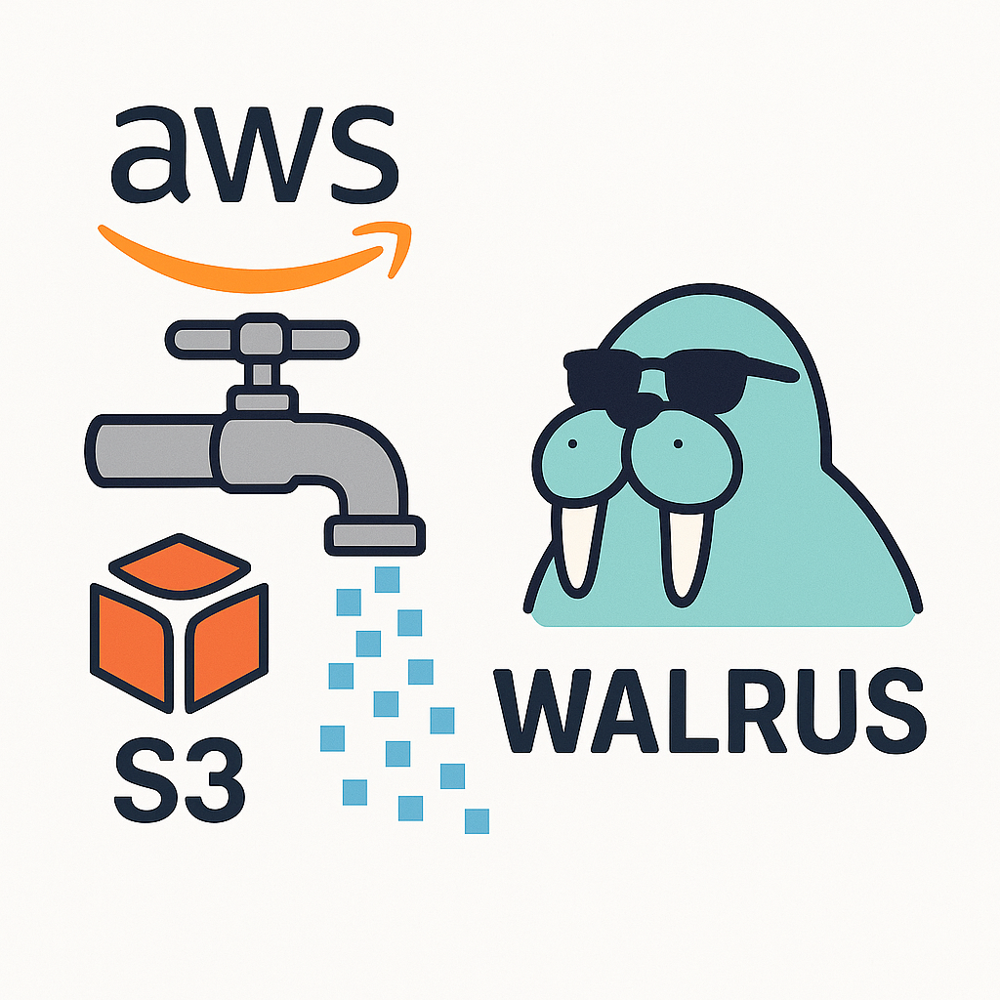

# What is Ingester?

**Ingester** is a Go-based CLI tool designed to ingest data into Walrus seamless and predictable.

> **Like opening the tap 🚰**

For this first iteration, it helps migrating existing data from **AWS S3** into Walrus.

{ style="max-width: 20%; height: auto;" }

More integrations are ready to come (e.g. Arweave -> Walrus).

## Context

Today, Walrus stores data as scattered blobs, with no built-in structure, and ingesting data into it is a manual, fragmented process.
As a result, every team has to build their own solution.

Ingester solves these two critical pain points by:

- Adding an automatic, schema-driven structure that organizes and relates blobs predictably.

- Providing ready-to-use integrations (like AWS S3) so teams can easily ingest data without extra development effort.

With Ingester, Walrus transforms from a raw storage system into a plug-and-play, developer-friendly platform.
Therefore accelerating adoption, reducing barriers, and unlocking its full potential across real-world use cases.
